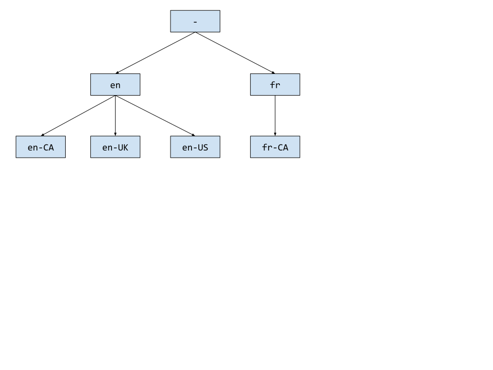

# Shaka Player - Fuzzy Locale Matching

## Summary
Language is a complex issue, and trying to match what language someone speaks with the best content option leaves a lot of room for interpretation. The core lesson we have learned from this is that if you try to be strict, you will be wrong most of the time. Because of this, when comparing the languages that a user wants with the content we have, we have adopted this strategy.

## Background
For a full explanation of the terms and definitions used when we talk about language please see our ["Talking about Languages"](talking-about-languages.md) article.

## Strategy
The question boils down to, "If the user says they prefer a specific locale, and we don't have it. What locale should we present to them?" To make things easier on us, we do not support dialects in our searches. When we read the locale, we purposely drop the dialect component as it simplifies the searches. We chose to adopt this short-cut because we have yet to see dialects appear in any content.

Conceptually locales follow a tree-like structure, so give a set of locales, we could create a tree like:



When we look for the best match, we try three searches. The searches are ordered from best to worst match so that once a match is found, we can stop searching. The searches are:
 - Locale Compatible
 - Parent Locale - A check where we see if one of our locales is the "parent" of the user's locale. For this to work:
   - our locale must only have a language component
   - the user's locale must have a language and region component
   - both locales must be Language Compatible
 - Language Compatible

## Examples
If we assume that we can only respond to requests with the following locales:
 - en
 - en-CA
 - en-US
 - fr-CA

Then for any given request, we should be able to identify what match we can make and what locale we would respond wit. The table below shows some examples:

```
User Wants | Matching Type       | Locale
-----------|---------------------|----------
en         | Locale Compatible   | en
en-UK      | Parent Locale       | en
fr         | Language Compatible | fr-CA
zk         | No Match            | No Match
```
